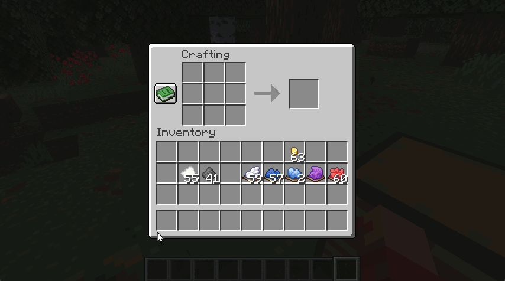

# Tint-able Firework Rocket

A Minecraft Client-side mod on Fabric
that provides color tints for firework rocket.

## Variants

### Flight duration

- 1 second 
  

- 2 seconds 
  

- 3 seconds 
  

### With firework stars

- Contains blue firework star, 1 second flight duration 
  

- Contains white firework star fade to red, 2 seconds flight duration 
  

- Multiple firework stars, red + blue + white 
  

Any resources are available under [`tintable-firework-rocket`](src/main/resources/assets/tintable-firework-rocket) namespace,
and you can modify using resource pack feature.

## Installation

Supports on [Fabric](https://fabricmc.net/use/) and requires [Fabric API](https://modrinth.com/mod/fabric-api).

[Modrinth Project page](https://modrinth.com/project/tint-able-firework-rocket) is available to download this mod.
